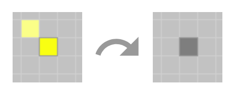
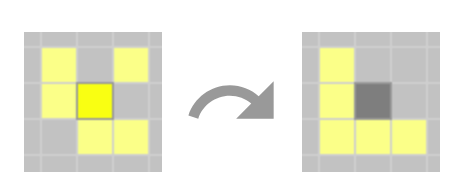
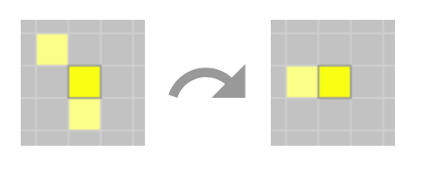
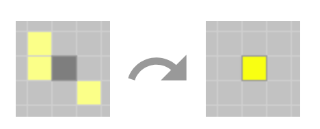
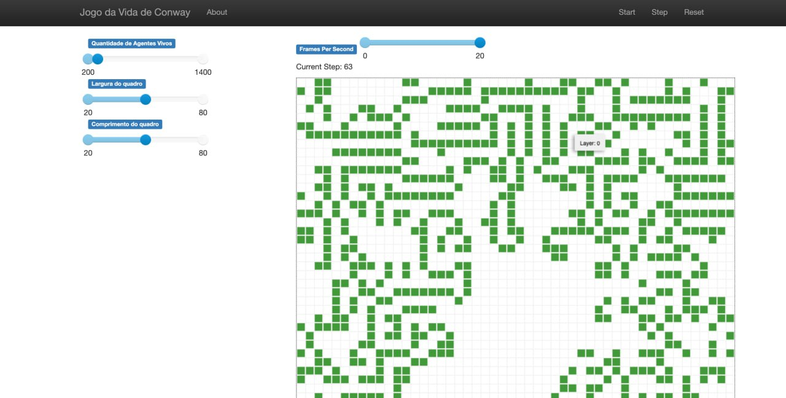
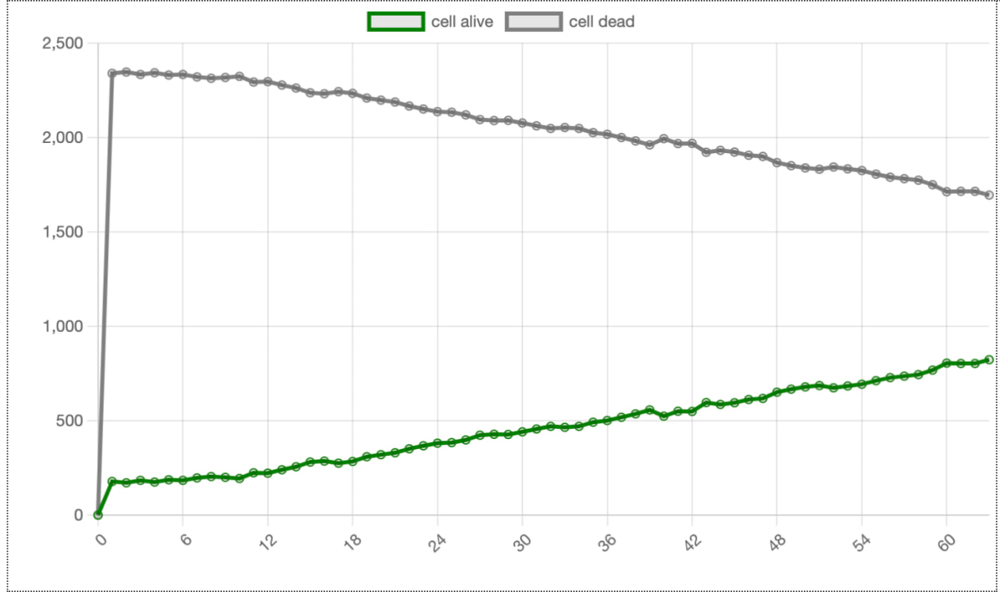

# Conway's Game of Life

**Disciplina**: FGA0210 - PARADIGMAS DE PROGRAMAÇÃO - T01 <br>
**Nro do Grupo**: 04<br>
**Paradigma**: Sistema Multi Agentes<br>

## Alunos
| Matrícula  | Aluno                                    |
| ---------- | ---------------------------------------- |
| 19/0124997 | Amanda Jeniffer Pereira Nobre            |
| 19/0101792 | Ana Carolina Rodrigues Leite             |
| 17/0101711 | Daniel Barcelos Moreira                  |
| 16/0119006 | Enzo Gabriel Guedes Queiroz Saraiva      |
| 18/0018604 | Hugo Sobral de Lima Salomão              |
| 18/0021974 | Leonardo da Silva Gomes                  |
| 17/0111288 | Micaella Lorraine Gouveia de Lima        |

## Sobre 
Este trabalho tem como objetivo a implementação do jogo [Conway's Game of Life](https://playgameoflife.com/) utilizando o paradigmas de Sistemas Multi-Agentes, utilizando a plataforma [Mesa](https://mesa.readthedocs.io/en/stable/).

O jogo consiste em simular uma comunidade de células que, com base em algumas regras matemáticas, podem viver, morrer ou se multiplicar. Dependendo das condições iniciais, as células formam vários padrões ao longo do jogo. As regras de sobrevivência são as seguintes:

Para um espaço preenchido:
1. Cada célula com um ou nenhum vizinho morre, como que por solidão.

2. Cada célula com quatro ou mais vizinhos morre, como se fosse superpopulação.

3. Cada célula com dois ou três vizinhos sobrevive.


Para um espaço vazio:
1. Cada célula com três vizinhos torna-se preenchida.


### Prova de Conceito: Comportamento Financeiro
Com o intuito de aprender o paradigma usando a ferramenta mesa, foi desenvolvida uma Prova de Conceito (POC) baseada em tutorais referenciados no fim do documento.

Ela consegue explorar vários conceitos da ferramenta, e auxiliou no desenvolvimento do projeto final, sendo essencial para mapeamento das incompatibilidades de versão que estão acontecendo durante as recentes refatorações da ferramentea. Além disso, foi possível realizar uma arquitetura que desacoplasse ao máximo as regras de implementação do framework.


## Screenshots




## Instalação 
**Linguagens**: Python <br>
**Tecnologias**: mesa e Docker<br>
**Pré-requisitos**: Docker ou mesa<br>

Após clonar o repositório, você pode optar por utilizar o ambiente dockerizado ou o próprio mesa.

1. Usando Docker: Na raíz do projeto, rode:
```
docker compose up -d
```

2. Usando mesa: Na raíz do projeto, rode:
```
python main.py
```

## Uso 

Após rodar o servidor localmente, uma interface gráfica será disparada na tela.

1. Será possível selecionar, pela interface gráfica, os seguintes parâmetros:
- Altura do grid
- Largura do gri
- Quantidade de agentes vivos

2. Após selecionar, aperte em Reset e as configurações definidas serão implementadas

3. Agora, aperte Start e o jogo irá começar.

Será possível ver o comportamento dos agentes e um gráfico mostrando a proporção entre agentes vivos e mortos em tempo real.
## Vídeo

[https://youtu.be/Sy7QhmOLVqY](https://youtu.be/Sy7QhmOLVqY)
 

## Participações

| Nome do Membro                      | Contribuição | Significância da Contribuição para o Projeto |
| - | - | - |
| Amanda Jeniffer Pereira Nobre       | Sem participação | Nula |
| Ana Carolina Rodrigues Leite        | Filtro de vizinhos vivos e mortos e o renascimento | Regular |
| Daniel Barcelos Moreira             | Dockerização do ambiente | Regular |
| Enzo Gabriel Guedes Queiroz Saraiva | Dockerização do ambiente e auxílio com a construção da POC | Boa | 
| Hugo Sobral de Lima Salomão         | Idealização do tema, criação e implementação da arquitetura, implementação da POC, desenvolvimento do Game Of Life | Excelente |
| Leonardo da Silva Gomes             | Idealização do tema, implementação da POC, desenvolvimento do Game Of Life | Excelente |
| Micaella Lorraine Gouveia de Lima   | Idealização do tema, implementação da POC, desenvolvimento do Game Of Life | Excelente |

## Outros 

### Lições Aprendidas
| Nome do Membro                      | Lições |
| - | - |
| Amanda Jeniffer Pereira Nobre       | - |
| Ana Carolina Rodrigues Leite        | Aprendizado sobre como fazer a filtragem de vizinhos vivos e mortos, dentro do grid e verificando os casos em que ele renasce e um pouco sobre o paradigma SMA.  | 
| Daniel Barcelos Moreira             | Aprendizado sobre a dockerização do ambiente e um pouco sobre o paradigma SMA. |
| Enzo Gabriel Guedes Queiroz Saraiva | Neste projeto, foi possível aprender sobre SMA em geral, que era um paradigma completamente desconhecido até então. Foi legal ver como os agentes se relacionam e são utilizados. Além disso, foi legal também aprender sobre o framework MESA que é um framework de python para este paradgima. | 
| Hugo Sobral de Lima Salomão         | Foi possível implementar os agentes e os diferentes níveis de controle inerentes ao paradigma. Além dos conceitos do paradigma em si, foi possível exercitar conhecimentos de arquitetura e reutilização de software para implementar estilos modernos e emergentes, como é o caso da feature flag implementada no projeto. |
| Leonardo da Silva Gomes             | Um dos principais ganhos dentro dessa etapa da disciplina foi a construção de um SMA e a idealização do mesmo, além de ser uma tremenda quebra de paradigmas e de contruções de estruturas enraizadas ao decorrer do curso | 
| Micaella Lorraine Gouveia de Lima   | Com este projeto foi possível entender o paradigma SMA de forma prática, evidenciando os comportamentos dos agentes e como as regras do jogo se encaixam nesse comportamento. Pude participar ativamente da idealização do tema, da construção da POC como forma de aprendizado da plataforma mesa, ajudando significativamente no desenvolvimento do projeto final | 

### Percepções
| Nome do Membro                      | Percepções |
| - | - |
| Amanda Jeniffer Pereira Nobre       | - |
| Ana Carolina Rodrigues Leite        | Acredito que a forma como o paradigma tenta representar situações que são mais complexas, é curioso pensar e entender a forma como ele funciona.  | 
| Daniel Barcelos Moreira             | Existem alguns tutoriais que auxiliam na realização da dockerização do ambiente. |
| Enzo Gabriel Guedes Queiroz Saraiva | Assim como nos demais paradgimas aprendidos anteriormente, foi interessante ter que reprogramar o cérebro para pensar diferente ao aprender um novo paradgima. E ter essa capacidade é algo muito importante na vida de um programador, pois ter que se adaptar ao mercado é fundamental. | 
| Hugo Sobral de Lima Salomão         | É notável a facilidade do paradigma em modelar e representar sistemas com alta volatilidade e e fortes tendências à entropia. Por meio da utilização de conceitos de agentes inteligentes e autônomos, é possível modelar inteligências que escalam de um nível individual para um coletivo entrópico. |
| Leonardo da Silva Gomes             | Nesse etapa pude entrar dentro de outra perspectiva de codificação e conceitos nos quais consegui imergir dentro de definições, que antes se baseavam apenas em machine learning, mas que puderam expandir para outro olhares. | 
| Micaella Lorraine Gouveia de Lima   | O paradigma SMA é muito interessante e diferente da forma como pensamos programação normalmente. Te faz enxergar agentes por meio de comportamentos, e foi uma virada de chave a questão dele ser independente | 

### Fragilidades
| Nome do Membro                      | Fragilidades |
| - | - |
| Amanda Jeniffer Pereira Nobre       | - |
| Ana Carolina Rodrigues Leite        | Percebi que a maior fragilidade foi entender o modo como o paradigma funcionava. | 
| Daniel Barcelos Moreira             | Praticamente não tive contato com o paradigma, porém uma fragilidade que percebi é a dificuldade para realizar personalizações na interface. |
| Enzo Gabriel Guedes Queiroz Saraiva | De modo geral, o grupo foi se fragilizando ao longo do semestre, pois alguns membros acabaram saindo conforme as entregas. De um modo mais específico sobre o paradigma, pude perceber que esse foi o que mais tive problemas para entender, foi mais difícil de compreender a lógica | 
| Hugo Sobral de Lima Salomão         | O Mesa ainda é uma plataforma altamente engessada às diretrizes idiomáticas do framework. Por mais que a ferramenta ofereça bastante com pouco esforço, o nível de personalização da mesma é bastante limitado. |
| Leonardo da Silva Gomes             | Com o fim da disciplina, pude relatar que esta etapa foi a que eu encontrei maior dificuldade, as abstrações que os frameworks trazem não tinham ficado muito claros na minha cabeça, mas pude melhorar esse entendimento quando finalmente coloquei a mão na massa. | 
| Micaella Lorraine Gouveia de Lima   | A plataforma tem suas fragilidades, e por questões de tempo não conseguimos evoluir o trabalho para ter uma interface mais amigável com a ideia proposta.| 

### Trabalhos Futuros
- Melhoria na visualização do grid.
- Possibilidade de adicionar agentes no grid selecionando o grid.

## Fontes
- Sequência de tutoriais sobre a ferramente ```mesa```. Disponível em <https://youtu.be/PDrAsw3UIlA> e em <https://www.youtube.com/watch?v=s7i-TZvIyWQ&t=612s>.
- Carneiro, Joel. "How does COVID-19 continue to spread? - A simulation 2.0 (How it was built)". Disponível em <https://smartinsightblog.blogspot.com/2021/01/how-does-covid-19-continue-to-spread.html>
- mesa. "Introductory Tutorial". Disponível em <https://mesa.readthedocs.io/en/stable/tutorials/intro_tutorial.html>
- mesa. "Advanced Tutorial". Disponível em <https://mesa.readthedocs.io/en/stable/tutorials/adv_tutorial.html>
- Aula acerca de Sistemas Multiagentes baseados em Python da HSMA. Disponível em <https://youtu.be/VeQkhfDYyMc>
- Aplicação original do Conway's Game of Life. Disponível em <https://playgameoflife.com/>
